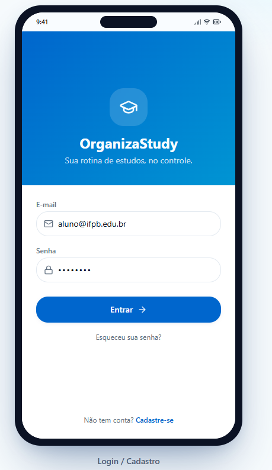
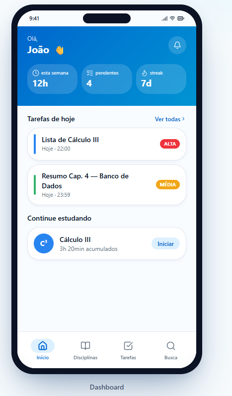
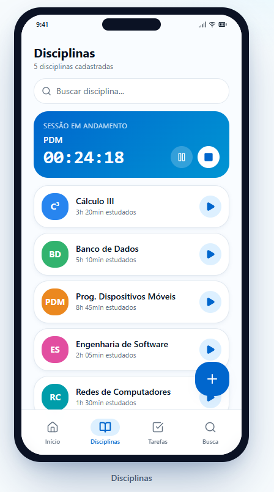
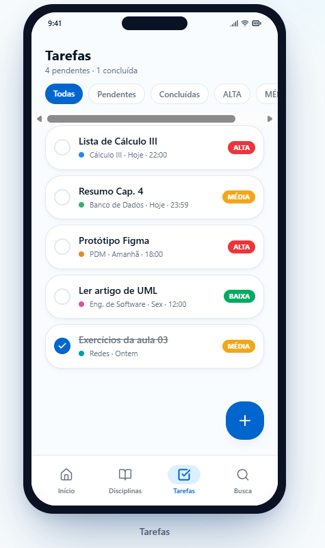
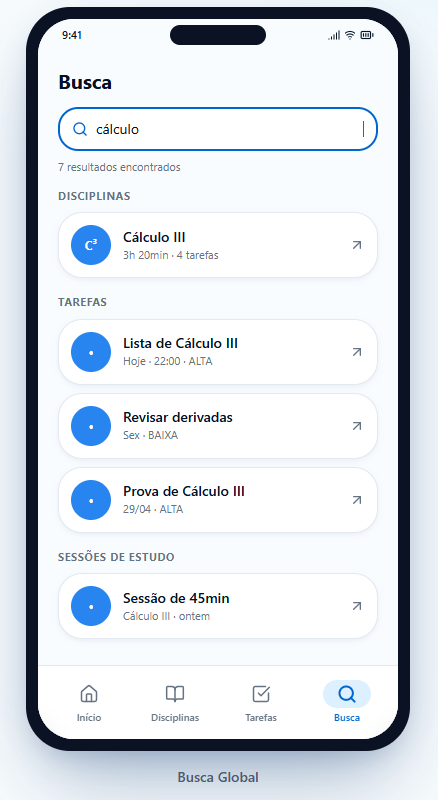
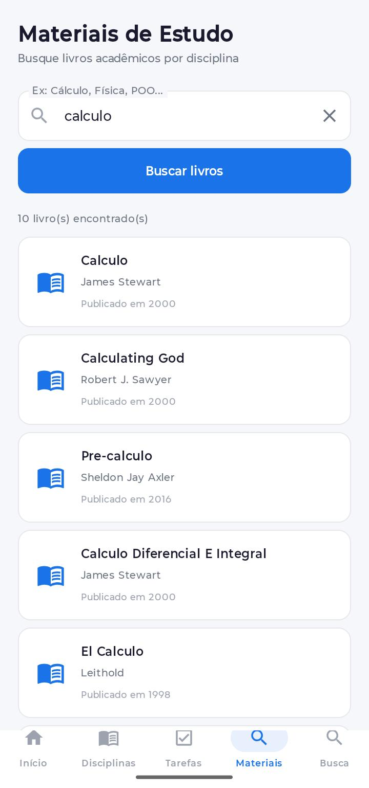

# OrganizaStudy Mobile

> Transformando desorganização acadêmica em produtividade real.

Um ecossistema mobile que permite estudantes gerenciarem disciplinas, cronometrarem sessões de estudo e acompanharem seu desempenho, tudo em tempo real.

---

## O Problema & A Solução

Muitos estudantes perdem o ritmo de aprendizado por não saberem quanto tempo dedicaram a cada matéria, ou por deixarem tarefas se acumularem sem controle.

O **OrganizaStudy** resolve isso centralizando o fluxo real de estudo em três etapas:

| Etapa | O que faz |
|-------|-----------|
| 📋 **Planejamento** | Gestão de disciplinas e tarefas por prioridade |
| ⏱️ **Execução** | Timer integrado que registra o esforço automaticamente |
| 📊 **Análise** | Dashboard com métricas de tempo e streaks de consistência |

---

## Funcionalidades

### Gestão de Acesso
- **Firebase Auth** :Fluxo seguro de Cadastro, Login e Logout
- **Persistência de sessão** : Acesso rápido sem re-login

### Organização Acadêmica
- **Disciplinas (CRUD)** : Personalização por cores e busca dinâmica em tempo real
- **Tarefas (CRUD)** : Priorização (Alta / Média / Baixa) com prazos e filtros

### Ciclo de Estudo Ativo
- **Timer Inteligente** : Registro automático de segundos no Firestore vinculado à disciplina
- **Dashboard** : Horas totais estudadas, tarefas pendentes e streak de disciplinas ativas

### Busca & Filtros
- **Busca global** : Encontra disciplinas e tarefas simultaneamente
- **Filtros reativos** : Por status (Pendente/Concluída) e prioridade

### Materiais de Estudo
- **API REST via Retrofit** : Busca livros acadêmicos na Open Library API
- **Resultados em tempo real** : Título, autor e ano de publicação

---

## Habilidades Técnica

| Camada | Tecnologia |
|--------|------------|
| Linguagem | Kotlin |
| UI | Jetpack Compose + Material Design 3 |
| Arquitetura | MVVM |
| Banco de Dados | Cloud Firestore (tempo real) |
| Autenticação | Firebase Authentication |
| API REST | Retrofit 2 + Gson Converter |
| Navegação | Navigation Compose |
| Assincronismo | Coroutines + StateFlow + Flow |

---

## Interface

<table>
  <tr>
    <td align="center"><b>Login / Cadastro</b></td>
    <td align="center"><b>Dashboard</b></td>
    <td align="center"><b>Disciplinas</b></td>
  </tr>
  <tr>
    <td></td>
    <td></td>
    <td></td>
  </tr>
  <tr>
    <td align="center"><b>Tarefas</b></td>
    <td align="center"><b>Busca Global</b></td>
    <td align="center"><b>Materiais (API)</b></td>
  </tr>
  <tr>
    <td></td>
    <td></td>
    <td></td>
  </tr>
</table>

---

## Como Executar

**1. Clone o repositório**
```bash
git clone https://github.com/seu-usuario/organizastudy-mobile.git
```

**2. Abra no Android Studio**
- Use a versão **Ladybug** ou superior

**3. Configure o Firebase**
- Crie um projeto no [Console do Firebase](https://console.firebase.google.com/)
- Ative **Authentication** (e-mail/senha) e **Firestore Database**
- Baixe o `google-services.json` e adicione em `/app`

**4. Execute o projeto**
- Rode o **Gradle Sync**
- Clique em **Run** no emulador ou dispositivo físico

---

## 👨‍💻 Autor

Desenvolvido por **Gabriel Pereira de Carvalho**

Disciplina: Programação de Dispositivos Móveis — IFPB Campus João Pessoa

Professor: Edemberg Rocha